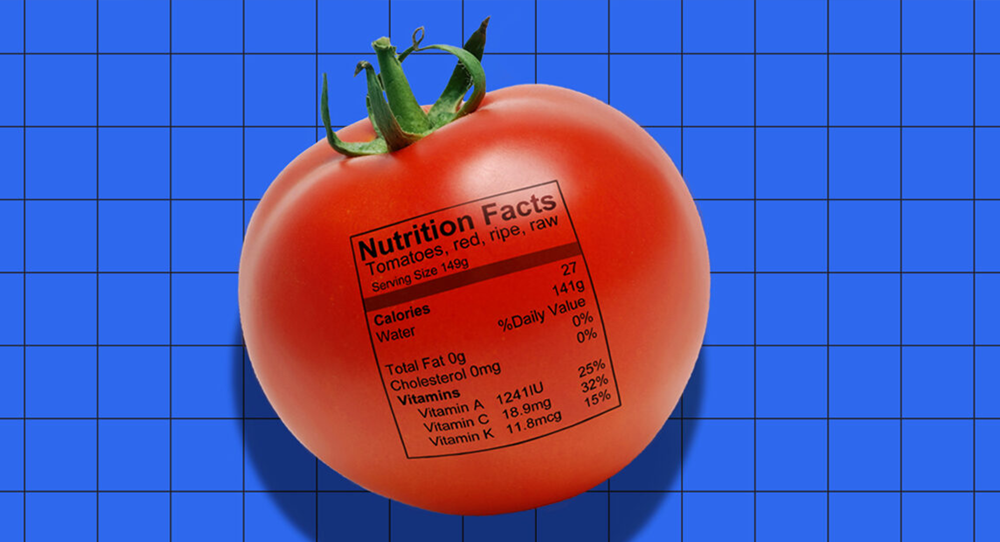

<!-- ABOUT THE PROJECT -->
## About

The aim of the project is to inform the user about how many calories they should consume on that specific day.

(<a href="#top">back to top</a>)

<!-- TECH -->
## Framework Used

Install and update using `pip`:

    $ pip install -U Flask

(<a href="#top">back to top</a>)

<!-- CONTRIBUTING -->
## Contributing

If you would like to add any extra features to the optimisation simulation, feel free to fork and create a pull request. Thank you!

1. Fork the Project
2. Create your Feature Branch (`git checkout -b feature/AmazingFeature`)
3. Commit your Changes (`git commit -m 'Add some AmazingFeature'`)
4. Push to the Branch (`git push origin feature/AmazingFeature`)
5. Open a Pull Request

(<a href="#top">back to top</a>)

<!-- CONTACT -->
## Contact

Erol Gelbul - [Website](http://www.erolgelbul.com) - erolgelbul@gmail.com

Project Link: [Calories Web](https://github.com/ErolGelbul/calories-web)

(<a href="#top">back to top</a>)

