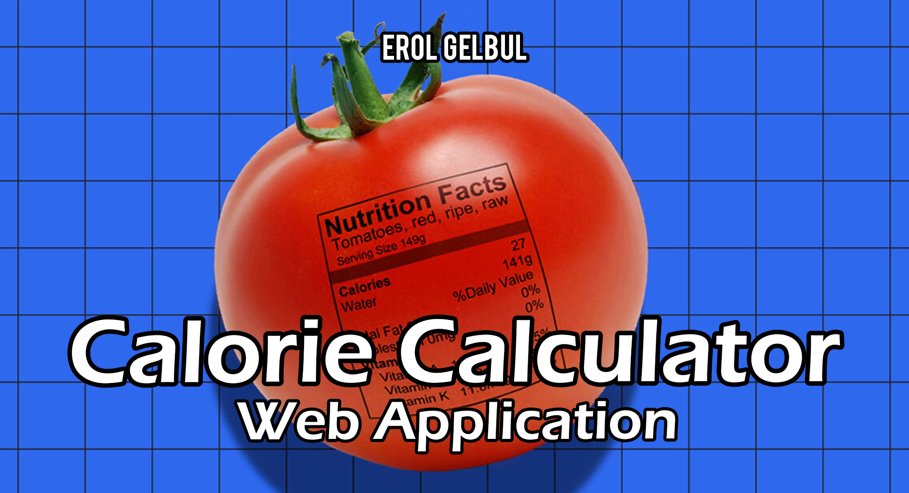
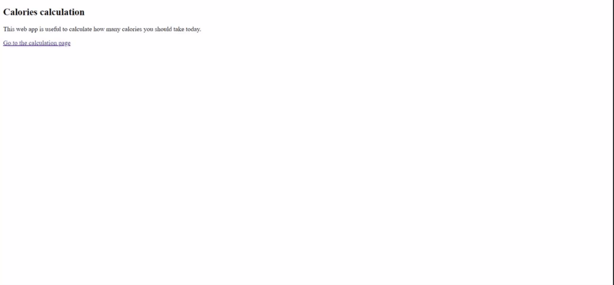

<!-- ABOUT THE PROJECT -->
## About

The aim of the project is to inform the user about how many calories they should consume on that specific day. The main part of
the project revolves around calculating the BMI value of the user by getting some user data. I used the Calorie class to do this
calculation.

`BMR = 10 * weight + 6.25 * height - 5 * age + 5 - 10 * temperature` formula is used.

The second part of project is on webscraping. I did only used SelectorLib package to extract HTML data from the web page. This
specific website that I worked with did not pose any problems while scraping data, however, some sites only allow browsers to 
access the information. Therefore, I added headers while trying to reach the website. In the Temperature class I cleaned up the
returned docstring. Later I only outputted the temperature value on float (used Celcius for calculations).

Ultimately, gathered the local temperature data of the user and their information to calculate how many calories they require for
the day.

(<a href="#top">back to top</a>)

<!-- TECH -->
## Technologies

Web Frameworks: [Flask](https://flask.palletsprojects.com/en/2.0.x/) - install: `$ pip install -U Flask`

Libraries & Packages: [WTForms](https://wtforms.readthedocs.io/en/3.0.x/), [SelectorLib](https://selectorlib.com/)

(<a href="#top">back to top</a>)

<!-- CONTRIBUTING -->
## Contributing

If you would like to add any extra features to the optimisation simulation, feel free to fork and create a pull request. Thank you!

1. Fork the Project
2. Create your Feature Branch (`git checkout -b feature/AmazingFeature`)
3. Commit your Changes (`git commit -m 'Add some AmazingFeature'`)
4. Push to the Branch (`git push origin feature/AmazingFeature`)
5. Open a Pull Request

(<a href="#top">back to top</a>)

<!-- CONTACT -->
## Contact

Erol Gelbul - [Website](http://www.erolgelbul.com) - erolgelbul@gmail.com

Project Link: [Calories Web](https://github.com/ErolGelbul/calories-web)

(<a href="#top">back to top</a>)

